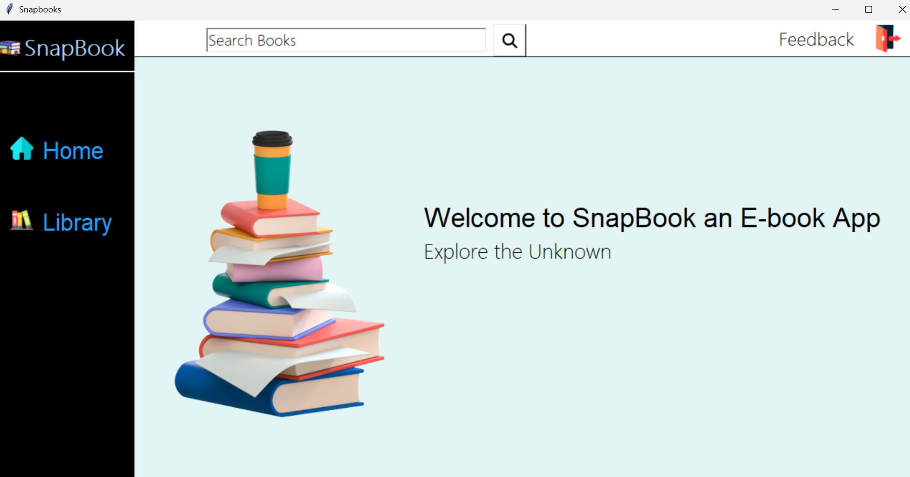
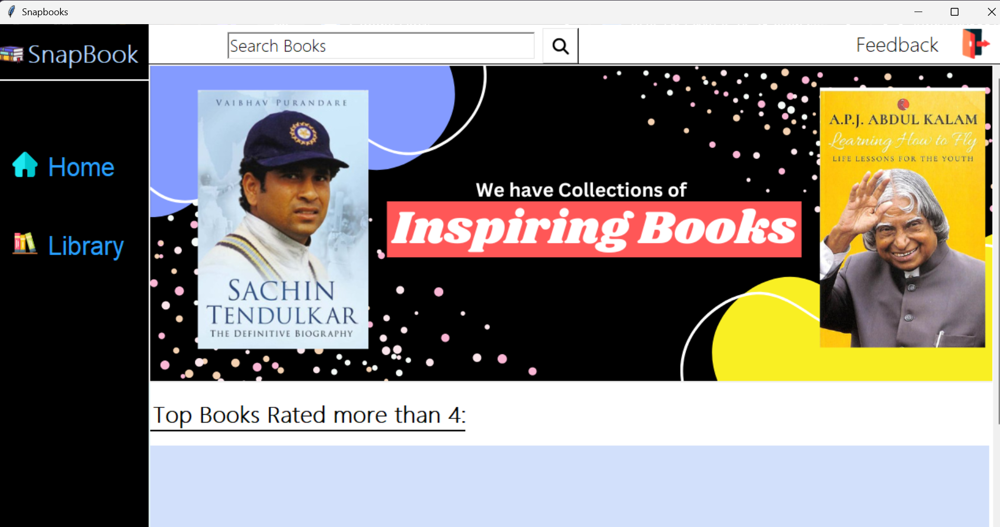
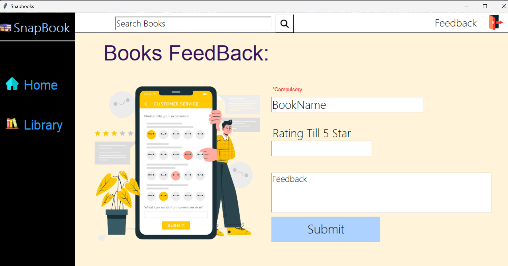

# 📚 Library Management Desktop App

A **Library Management System** built using **Python Tkinter** for GUI and **MySQL** for the backend.  
This application allows users to easily manage books, track borrowings, and maintain library records efficiently.

---

## ✨ Features

- Add, search, update, and delete book records
- Issue and return books
- Track borrow history
- Secure data storage with MySQL
- Intuitive and clean GUI for easy navigation
- Admin login system (optional, if implemented)

---

## 🛠️ Tech Stack

- **Frontend:** Python Tkinter
- **Backend:** MySQL Database
- **Language:** Python 3.x

---

## 🖼️ Screenshots

| Home Page | Dashboard | Books Feedback |
| :---: | :---: | :---: |
|  |  |  |

---

## 🚀 Setup Instructions

### 1. Clone the repository

```bash
git clone https://github.com/your-username/library-management-desktop-app.git
python main.py